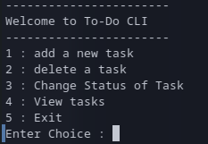
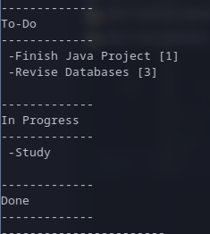

# CLI To-Do

A simple command-line To-Do application written in Java.

This program runs inside the terminal. It was made as a way for me to practise Java fundamentals such as basic project structure, classes, enums, and compiling Java programs from the CLI.
<br>

<br>
<br>

<br>


## Requirements

- Java JDK 17 or newer (`java --version`)
- A terminal (Tested on Fedora 43)

## How to Run

From the project root directory, run:

```bash
find src -name "*.java" | xargs javac -d out
java -cp out app.Main
